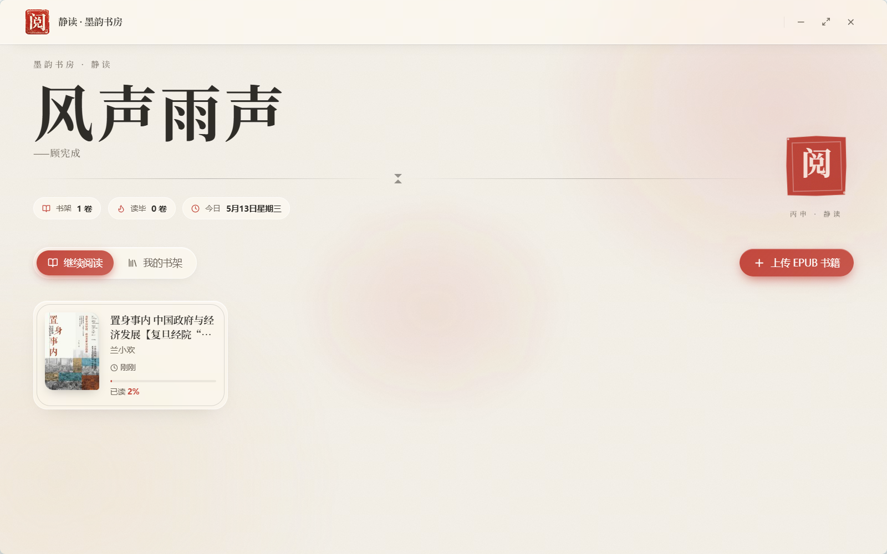
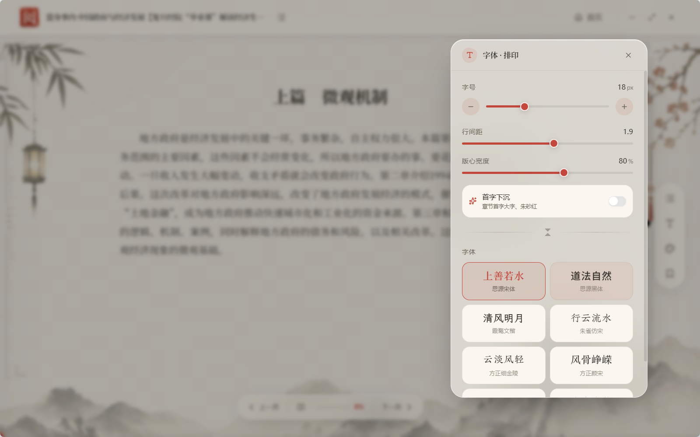
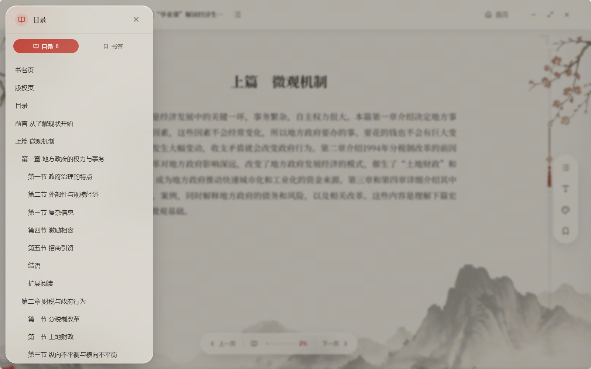

# EPUB Reader

基于 **React + TypeScript + Vite + Tauri 2（Rust）** 的 Windows 桌面 EPUB 阅读器。

## 界面展示

| | |
|:---:|:---:|
|  |  |
|  |  |

---

## 功能特性

- 支持本地 EPUB 文件通过系统文件对话框或拖拽打开
- 目录导航与章节跳转
- 书签管理
- 阅读历史（书架），书籍文件持久化存储于系统 AppData 目录
- 阅读设置：字体、字号、行间距、内容宽度、主题
- 多种主题：浅色、深色、护眼绿、暗绿、深蓝、米黄
- 自定义中文字体（霞鹜文楷、朱雀仿宋、方正细金陵、方正颜宋）

## 技术栈

- React 19 + TypeScript 5.9
- Vite 7
- Tauri 2（Rust 后端）
- Tailwind CSS + shadcn/ui
- epubjs（EPUB 解析与渲染）
- Framer Motion

## 开发环境要求

- Node.js 20+
- Rust（通过 [rustup](https://rustup.rs/) 安装）
- Windows（当前仅支持 Windows）

## 开发命令

```bash
# 安装依赖
npm install

# 启动 Tauri 开发模式（同时启动前端 + Rust 后端，打开原生窗口）
npm run tauri:dev

# 构建生产安装包
npm run tauri:build

# 仅构建前端（不启动 Tauri）
npm run build

# ESLint 检查
npm run lint
```

## 构建输出

```bash
npm run tauri:build
```

构建完成后，安装包位于：

```
src-tauri/target/release/bundle/
├── nsis/    ← .exe 安装包（推荐）
└── msi/     ← .msi 安装包
```

## 项目结构

```
├── src/                  # React 前端
│   ├── components/       # UI 组件
│   ├── hooks/            # useReader、useSettings
│   ├── types/            # TypeScript 类型定义
│   └── App.tsx           # 根组件
├── src-tauri/            # Rust 后端
│   ├── src/
│   │   ├── commands.rs   # Tauri 命令（文件读写、设置持久化）
│   │   ├── storage.rs    # 书籍文件存储逻辑
│   │   ├── config.rs     # 设置/书签/历史的序列化
│   │   └── lib.rs        # Tauri 入口
│   ├── capabilities/     # Tauri 权限配置
│   └── tauri.conf.json   # Tauri 应用配置
└── public/fonts/         # 自定义中文字体（~31 MB）
```
